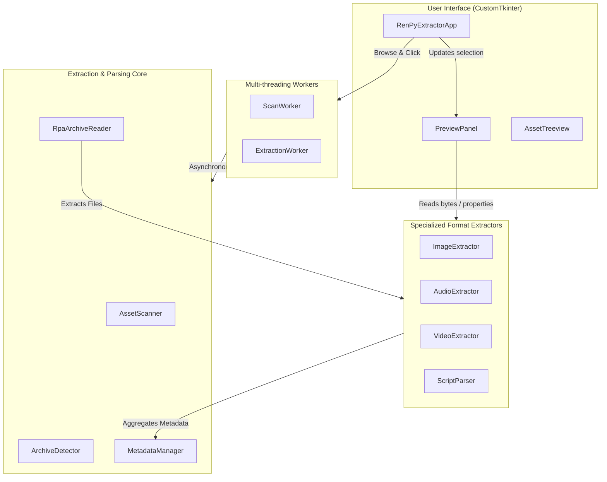

# Developer Guide

This developer guide provides an architectural overview, class breakdowns, and formatting details for developers working on the Ren'Py Asset Extraction Tool.

## Architecture Diagram

The application follows a clean layout separating data parsing, worker threads, and visual interface blocks:

## Archive Format Parsing details (RPAv3)

A Ren'Py Archive (RPA) v3 starts with an ASCII header line followed by raw data and index structures:

1. **Header Format**: `RPA-3.0 [index_offset] [key]\n`
   - `index_offset` is a 16-character hex string representing the byte offset in the archive where the index begins.
   - `key` is an 8-character hex string representing the XOR key.
2. **Obfuscation**:
   - The archive's index is stored at `index_offset`. It is a pickled dictionary compressed with `zlib`.
   - Once decompressed (`zlib.decompress()`) and unpickled (`pickle.loads()`), it yields a dictionary:
     `{ "relative/path/in/game.png": [(offset ^ key, length ^ key, prefix)] }`
   - We calculate the actual byte positions: `offset = stored_offset ^ key` and `length = stored_length ^ key`.
3. **Data Prepend (Prefix)**:
   - When extracting, we seek to the file's offset.
   - The file data block in the archive may have a prepended `prefix` (like `b"Made with Ren'Py."`). We read `length` bytes from `offset` and reconstruct the file by writing `prefix + read_bytes`.

## Extending Extractors

All extractor classes are designed with a stateless, unified API surface:
- **Input**: Accept either a file path (`pathlib.Path`) or raw data bytes (`bytes`). This enables immediate memory-based GUI previews as well as disk-based extraction walks.
- **Output**: Return a standard dictionary (`Dict[str, Any]`) populated with fields like width, duration, framerate, dialogue counts, etc.

To add a new extractor category (e.g. 3D Model resource parsing):
1. Register extension mappings in `core/config.py` under `SUPPORTED_EXTENSIONS`.
2. Add your parser file to the `extractors/` folder.
3. Hook the extractor call inside `core/metadata.py`'s `register_file()` method to populate `details` and output hashes.
4. Hook the layout view in `ui/preview.py` inside the `_show_preview_of_bytes_or_path` router.
